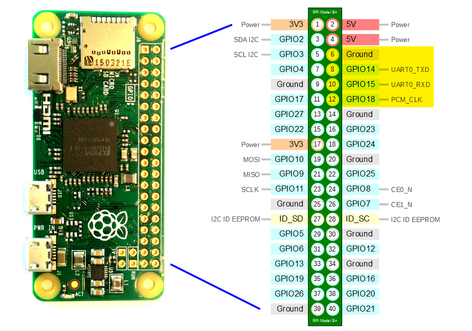

# nixos-micro-pi-cluster
---


|Pin|Color|
|---|---|
|Black|Ground|
|White|RX|
|Green|TX|
|Red| vcc|
---
| ipv4 | USB MAC | WiFi MAC | SN | Note |
| --- | --- | --- | --- | --- |
| 10.0.85.10 | dc:a6:32:62:18:5b | 2c:cf:67:aa:bb:cc | 8d4cb64d | microPi Cluster Head |
| 10.0.85.11 | 00:dc:1b:5a:4d:6b | 2c:cf:67:aa:bb:cc | 1b5a4d6b | microPi Cluster Node1 |
| 10.0.85.12 | 00:dc:fe:12:7c:b3 | 2c:cf:67:dd:ee:ff | fe127cb3 | microPi Cluster Node2 |
| 10.0.85.13 | 00:dc:04:a9:1e:c3 | 2c:cf:67:00:11:22 | 04a91ec3 | microPi Cluster Node3 |
| 10.0.85.14 | 00:dc:00:4f:17:e5 | 2c:cf:67:1d:9a:a3 | 004f17e5 | microPi Cluster Node4 |
---
### check this flake
```
nix flake check -v -L --no-build github:denver-cfman/nixos-micro-pi-cluster?ref=main
```

### show this flake
```
nix flake show --all-systems --json github:denver-cfman/nixos-micro-pi-cluster?ref=main | jq '.'
```

### build sd image for cluster head, use ` nix flake show github:denver-cfman/nixos-micro-pi-cluster?ref=main ` to list nodes
```
nix build --rebuild -L github:denver-cfman/nixos-micro-pi-cluster?ref=main#nixosConfigurations._8d4cb64d.config.system.build.sdImage
```

### copy sd image
```
sudo cp result/sd-image/8d4cb64d.img ~/
ls ~/
```

### remote update nix (nixos-rebuild) on cluster head
#### nixos-rebuild
```
sudo nixos-rebuild switch --flake github:denver-cfman/nixos-micro-pi-cluster#_8d4cb64d --target-host 10.0.85.10 --use-remote-sudo --build-host 10.0.81.242
```
#### deploy-rs
```
nix run github:serokell/deploy-rs github:denver-cfman/nixos-micro-pi-cluster#_8d4cb64d -- -s -d --ssh-user giezac --hostname 10.0.85.10
```
